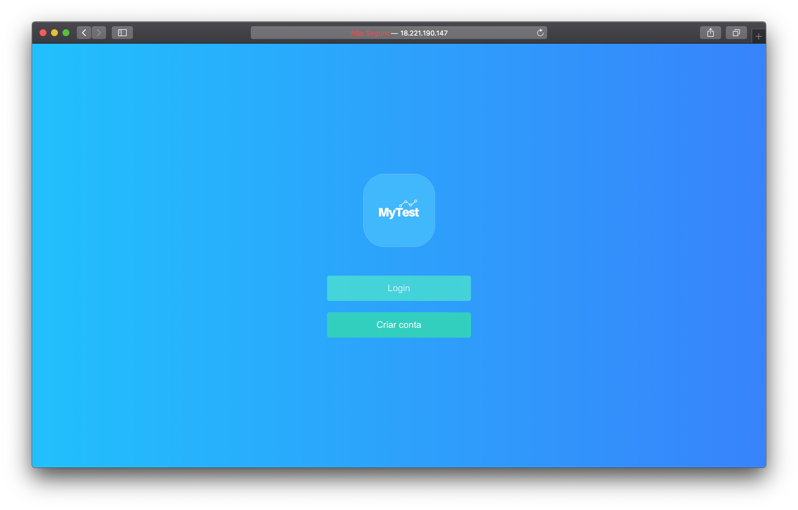
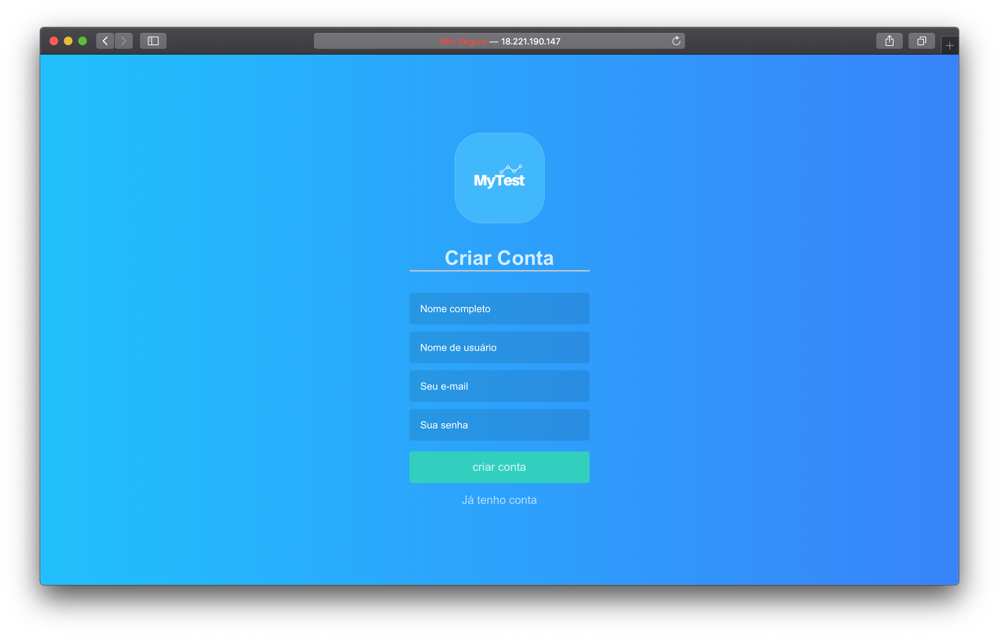
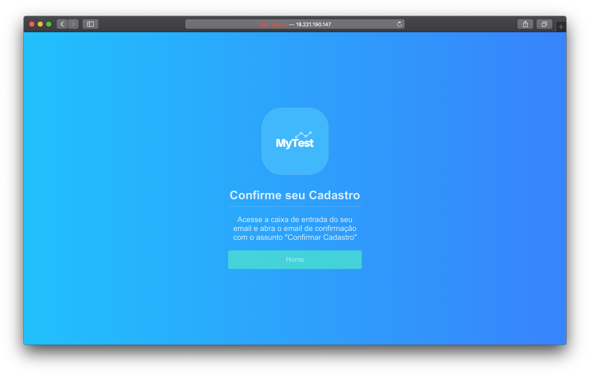
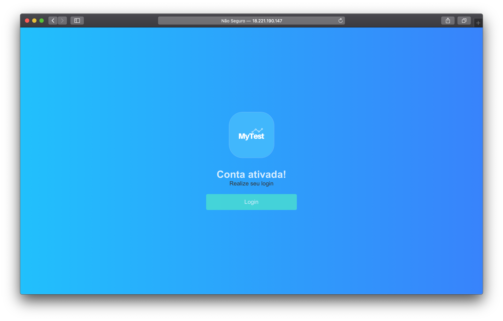
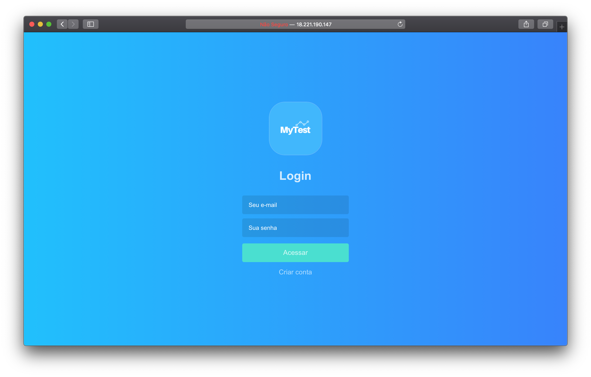
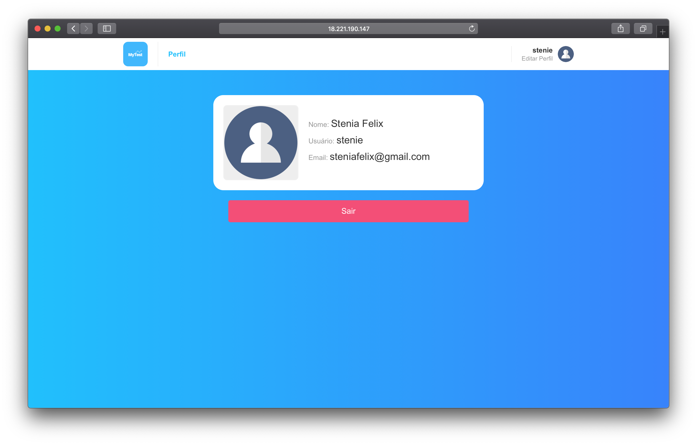
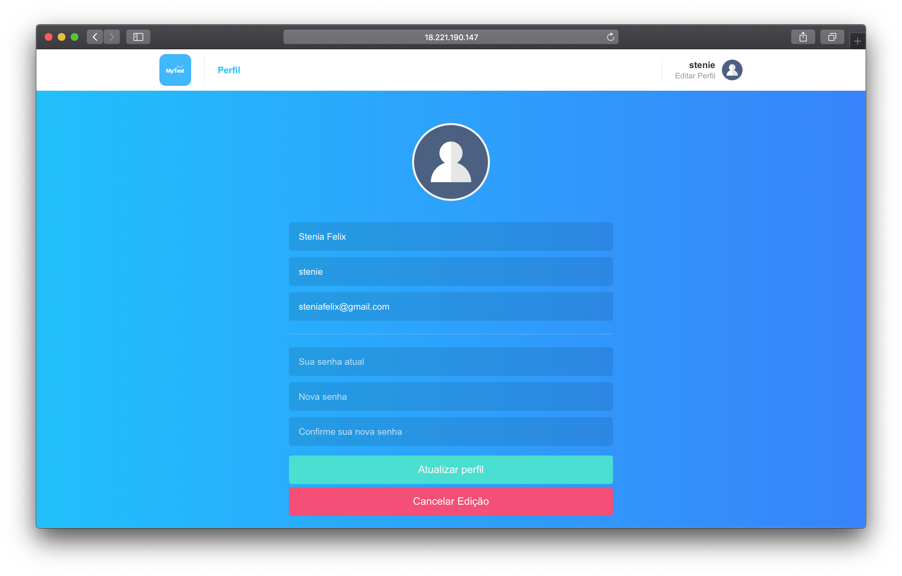
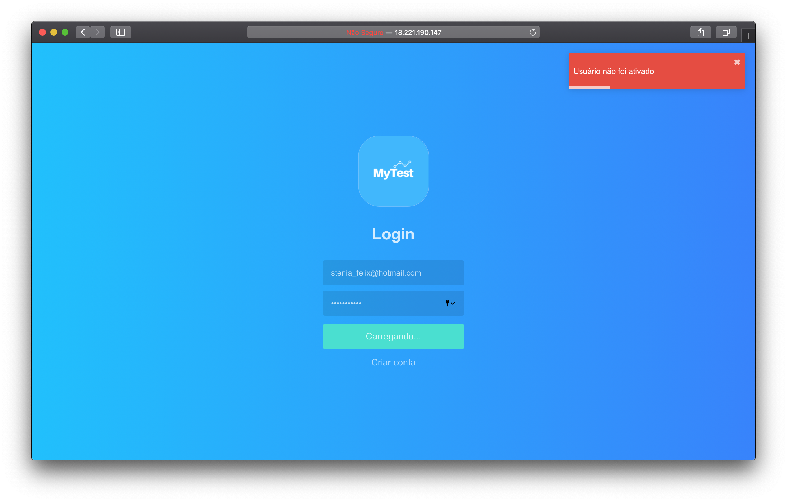
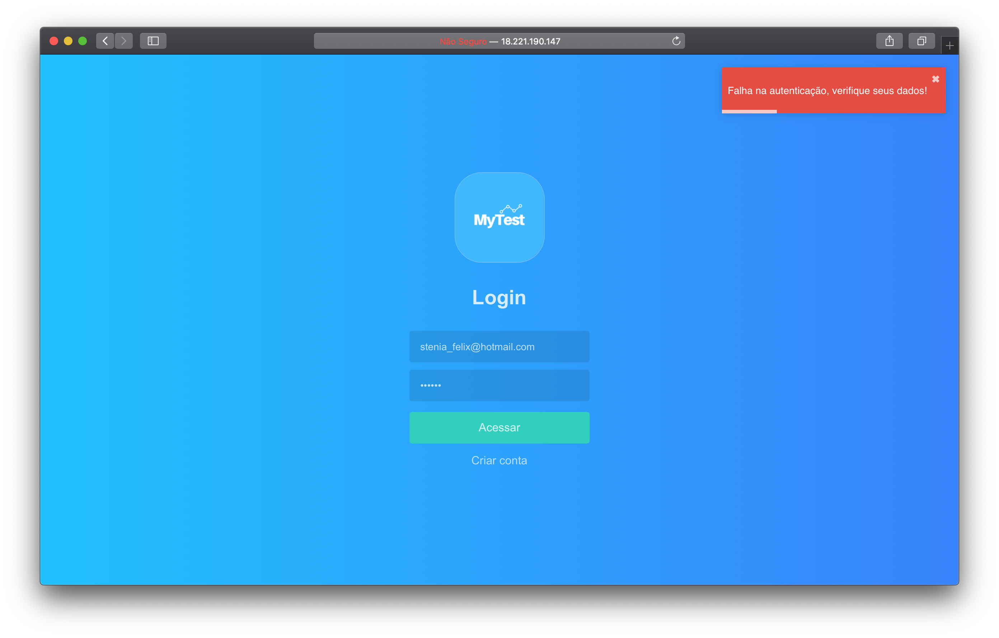
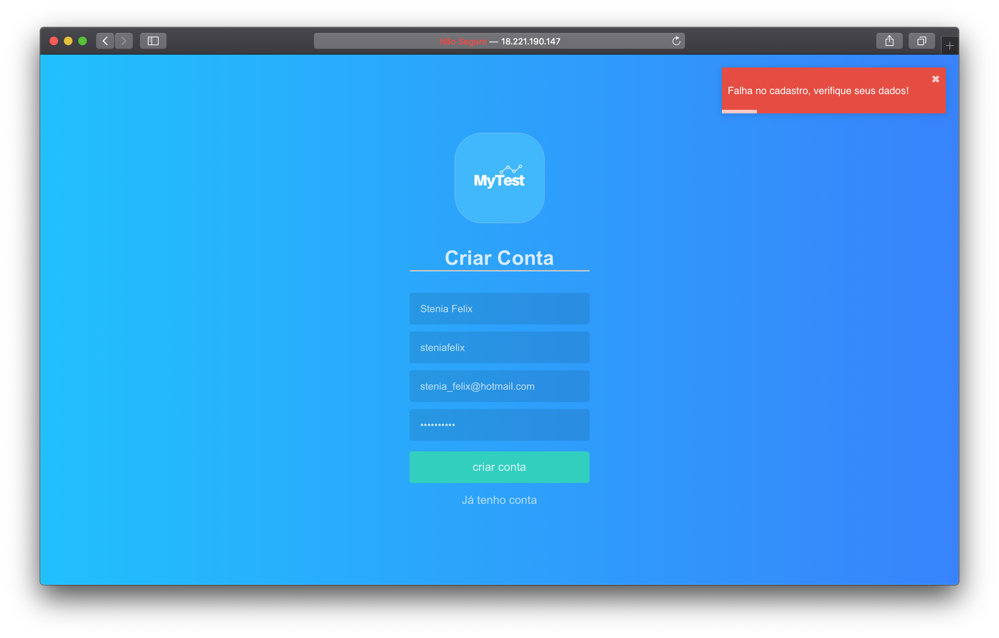

# MyTest

## :computer: Web preview

## :iphone: Mobile preview

- You can see the mobile app preview printscreens [here](https://github.com/steniafelix/MyTestMobile/blob/master/README.md).

## :key: Authentication

- [x] The user can login using e-mail and password.
- [x] I have used JWT to authenticate the user.
- [x] All login fields are checked via Yup.

## :man: User register and update

- [x] The user can register using name, e-mail and password.
- [x] To update the password user need to send a password confirmation and the old password.
- [x] User passwords are all encripted.
- [x] All register and update field requests are checked via Yup.

# :wrench: Running the project

- Yout need to set up all the react-native enviroment.
- Install docker and create a mysql container.
- Clone this repository.
- Install all dependencies using the command `yarn` in each directory, backend, mobile and frontend.
- Enter backend repository and fill the `.env` file.
- Enter backend directory and run `yarn run-dev`.
- Enter frontend directory and run `yarn start`.
- Enter mobile directory and run `react-native run-ios`.

# :fire: Used technologies

- ReactJS
- React Native
- NodeJS
- Node Mailer
- Styled Components
- Reactotron
- Redux
- Redux Saga
- MySql
- Docker
- Other React and Node libs.
